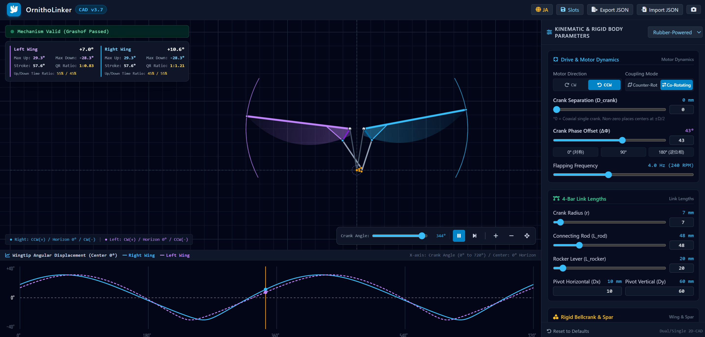
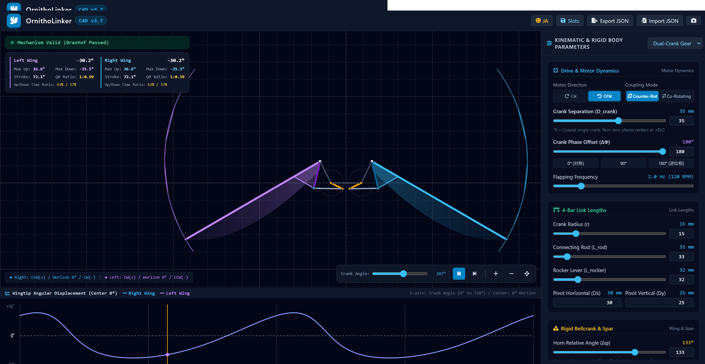

# 🕊️ OrnithoLinker

A browser-based 2D CAD simulator for intuitively designing and geometrically validating four-bar symmetrical linkages (crank-rocker mechanisms), which are the typical drive mechanisms for ornithopters (flapping-wing aircraft).

Since it is a self-contained single HTML file (`index.html`), it runs instantly simply by opening the file in a web browser or by accessing GitHub Pages:  
https://ys-lavic.github.io/OrnithoLinker/

---

## 📸 Screenshots

---

## ✨ Features

### 1. Analysis Engine
- **Real-Time Grashof Condition & Closed-Loop Equation Check**:  
  Continuously diagnoses whether mechanical interference or locking occurs throughout the full rotation.

### 2. Drive & Coupling Dynamics
- **Crank Center-to-Center Distance**:  
  Set to 0 mm for a single crank.  
  For dual cranks, set the distance between the two crank axes.
- **Motor Rotation Direction (CW / CCW)**:  
  Switch the motor's rotation direction (clockwise / counter-clockwise) to examine changes in upstroke and downstroke characteristics.
- **Left-Right Coupling Mode**:  
  - **Counter-Rotating**:  
    Typically used for dual-gear configurations. Counter-torque is cancelled via geared counter-rotation.  
  - **Co-Rotating**:  
    Typically used for single-gear setups. Synchronized rotation via belts or pulleys.
- **Crank Phase Offset Adjustment**:  
  Enables left/right wing phase adjustment for single-crank designs. For dual gears, typically set to 180°.  
  Allows simulation of in-phase, quadrature (90°), and antiphase/alternating flapping modes.

### 3. Design & Performance Monitor
- **Quick-Return Ratio Calculation (Up/Down Time Ratio)**:  
  Real-time display of the time and angular ratios between upstroke and downstroke. Helps quantitatively evaluate downstroke characteristics beneficial for lift generation.
- **Real-Time Angle Metrics**:  
  Displays maximum up angle, maximum down angle, and total stroke angle.
- **Angular Displacement Waveform Graph**:  
  Plots 2 full cycles of left and right wingtip displacements at the bottom. Useful for phase alignment.
- **Manual Crank Angle Seek Slider**:  
  Allows manual positioning of the crank angle both while paused and while running. Accurately inspect joint pin positions and linkage attitudes at critical phases such as top and bottom dead centers.

### 4. CAD Visualization, Usability & Data Management
- **Bilingual Interface (JA / EN)**:  
  Switch the display language with a single click in the header. English or Japanese.
- **Rigid Horn Plate Toggle**:  
  Toggle visibility of the triangular reinforcement horn plates at the root of the wing spars.
- **Wing Membrane Rendering**:  
  Simulates aerodynamic phase lag (deflection caused by air resistance) linked to the wings' angular velocity.
- **Canvas Navigation**:  
  Pan across the workspace with mouse drag, and zoom in/out with the scroll wheel.
- **Slot Presets (LocalStorage)**:  
  Save and recall multiple named design variations directly inside your browser.
- **JSON Import / Export**:  
  Save design parameters to external files to back up or share.
- **PNG Snapshot**:  
  Export the current CAD view as a high-resolution PNG image.

---

## 🎯 Built-in Presets

Three standard presets tailored to practical design configurations can be loaded with one click from the dropdown menu:

| Preset Name | Description & Applications |
| :--- | :--- |
| **Rubber-Powered** | For single-crank ultralight fliers, etc. Includes left/right phase correction. |
| **Single Crank** | For single-gear RC fliers, etc. Includes left/right phase correction. |
| **Dual Crank** | For dual-gear RC fliers, etc. Cancels counter-torque through counter-rotating left and right gears. |

---

## 🚀 How to Use

### Run Online as a Web App
https://ys-lavic.github.io/OrnithoLinker/

### Run Locally
No build tools or package installations are required.  
Simply download this repository as a ZIP file, extract it, and open `index.html` in any modern web browser.
