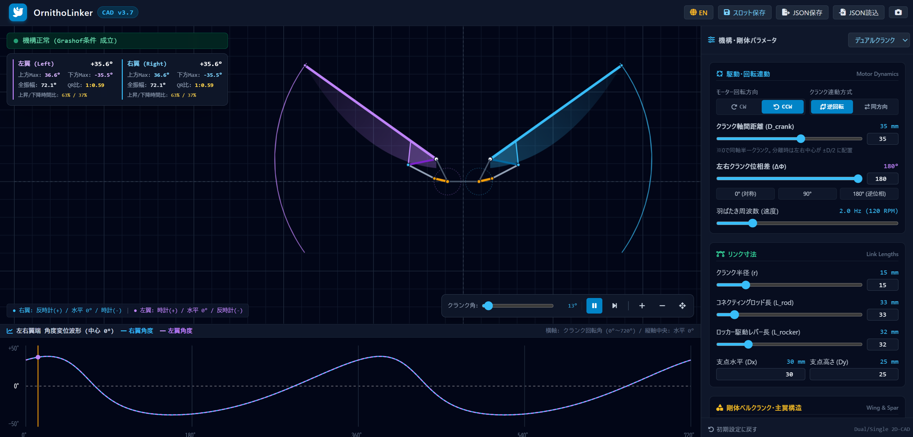
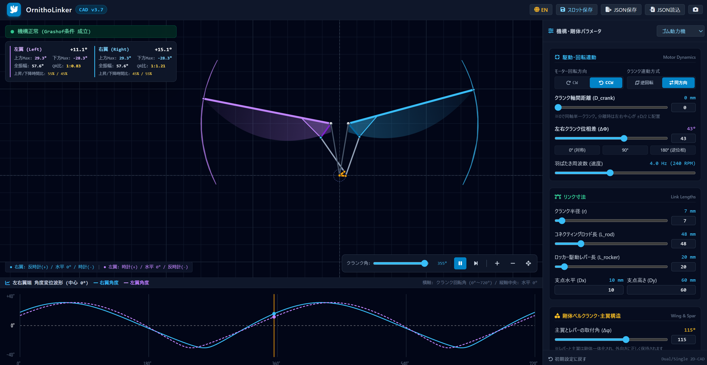

# 🕊️ OrnithoLinker

羽ばたき飛行機の代表的な駆動機構である 4節対称リンク機構（クランク・ロッカー機構） を、ブラウザ上で直感的に設計・幾何学検証できるWebベースの2D-CADシミュレーターです。

HTMLファイル（`index.html`）単体で完結しているので、ブラウザでファイルを開くだけ、またはGitHub Pagesへのアクセスで動作します。
  https://ys-lavic.github.io/OrnithoLinker/

---

## 📸 画面プレビュー

---

## ✨ 主な機能と特徴

### 1. 解析エンジン
- **Grashof条件 ＆ 閉ループ方程式リアルタイム判定**：
  機構の干渉や突っ張り（ロック）が発生しないかを常時診断します。

### 2. 駆動連動設定
- **クランク軸間距離の設定**：
  シングルクランクの場合は 0mm に設定。
  デュアルクランクの場合はクランク間の距離を設定。
- **モーター回転方向（CW / CCW）の切り替え**：
  モーターの回転方向（時計回り / 反時計回り）を切り替え、上昇・下降時の特性の変化を検証可能。
- **左右連動モードの選択**：
  - **対向逆回転**：
  デュアルギアの場合は通常こちら。ギア連動によるカウンタートルク相殺構成。
  - **同方向回転**：
  シングルギアの場合はこちら。ベルトやプーリー連動による同調回転。
- **クランク位相差の調整**：
  シングルクランクの場合の左右翼の位相調整が可能。デュアルギアの場合は通常 180°に指定。
  同位相だけでなく、直交位相や逆位相・交互羽ばたきのシミュレーションが可能。

### 3. 設計・性能モニター
- **上昇/下降時間比（Quick-Return 比）の算出**：
  アップストロークとダウンストロークの、所要時間比および角度比をリアルタイム表示。揚力獲得に有利なダウンストローク特性を定量評価できます。
- **最大上方角 / 最大下方角 / 全振幅（Stroke）のリアルタイム表示**
- **角度変位波形グラフ**：
  下部に2周期分の左右翼端変位を常時プロット。位相合わせに使用できる。
- **手動クランク角シークスライダー**：
  停止中および動作中にスライダーをドラッグしてクランク角を直接指定可能。上死点・下死点など特定位相のピン位置やリンク姿勢を静止状態で精密に確認できます。

### 4. CAD表示・操作性 ＆ データ管理
- **日英言語切り替え（JA / EN）**：ヘッダーのボタンからワンクリックで表示言語を即時切り替え。
- **剛体プレート（Horn Plate）表示切替**：主翼スパー付根の三角形補強板の表示／非表示をトグル選択可能。
- **翼膜表現**：主翼の角速度に応じた空気抵抗によるたわみ（位相遅れ）をアニメーション描画。
- **キャンバス操作**：マウスドラッグによるパン（平行移動）、ホイールによるズームイン／アウト。
- **スロット保存（LocalStorage）**：名前をつけて複数パターンの設計をブラウザ内に保存・呼び出し。
- **JSONインポート／エクスポート**：設計パラメータを外部ファイルとして保存・共有。
- **PNGスナップショット**：現在のCAD描画画面を高解像度画像としてダウンロード。

---

## 🎯 内蔵プリセット一覧

実機設計の用途に合わせた3つの標準プリセットをプルダウンからワンクリックで読み込めます：

| プリセット名 | 特徴と用途 |
| :--- | :--- |
| **ゴム動力機** | 単一クランクの軽飛行機など。左右の位相補正あり。 |
| **シングルクランク** | シングルギアのRCなど。左右の位相補正あり。 |
| **デュアルクランク** | デュアルギアのRCなど。左右ギアの対向逆回転でカウンタートルクを相殺できる構成。 |

---

## 🚀 使い方

### ウェブアプリとしてオンラインで実行する場合
  https://ys-lavic.github.io/OrnithoLinker/

### ローカル環境で実行する場合
  ビルドやパッケージのインストールは不要です。
  本リポジトリをZIPダウンロードし、index.htmlをブラウザで開いてください。
